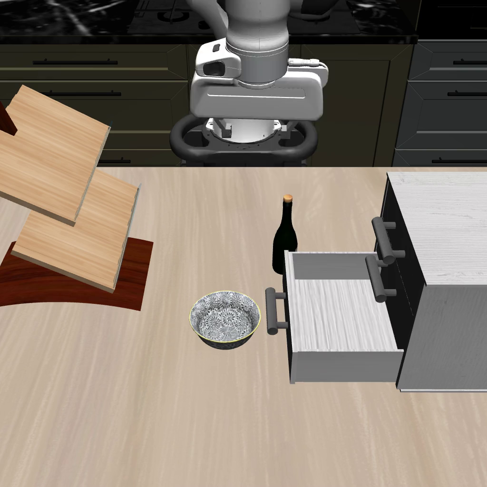
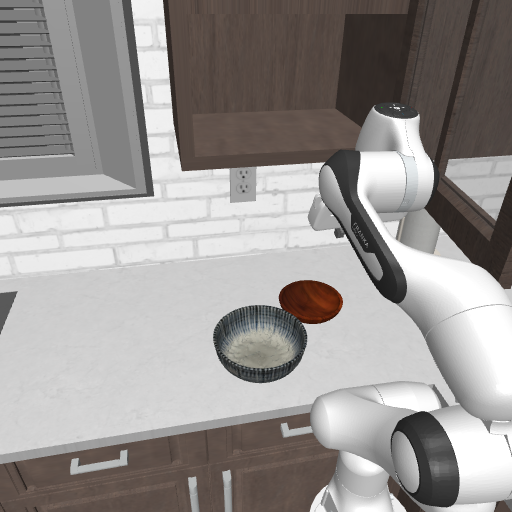
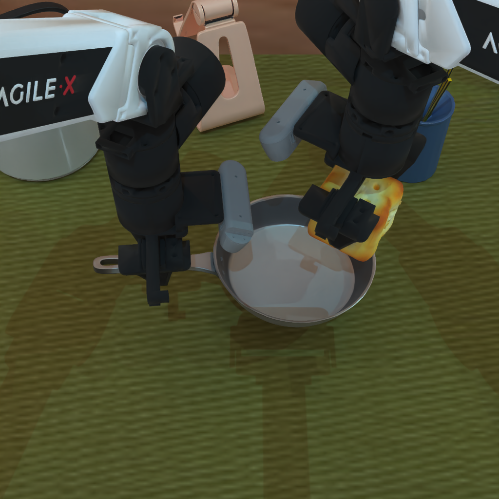
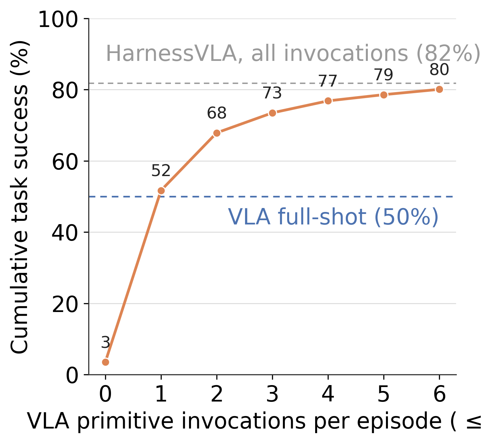
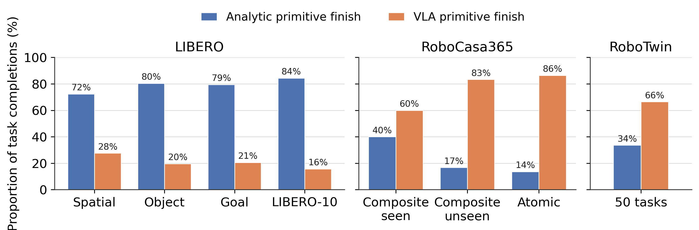
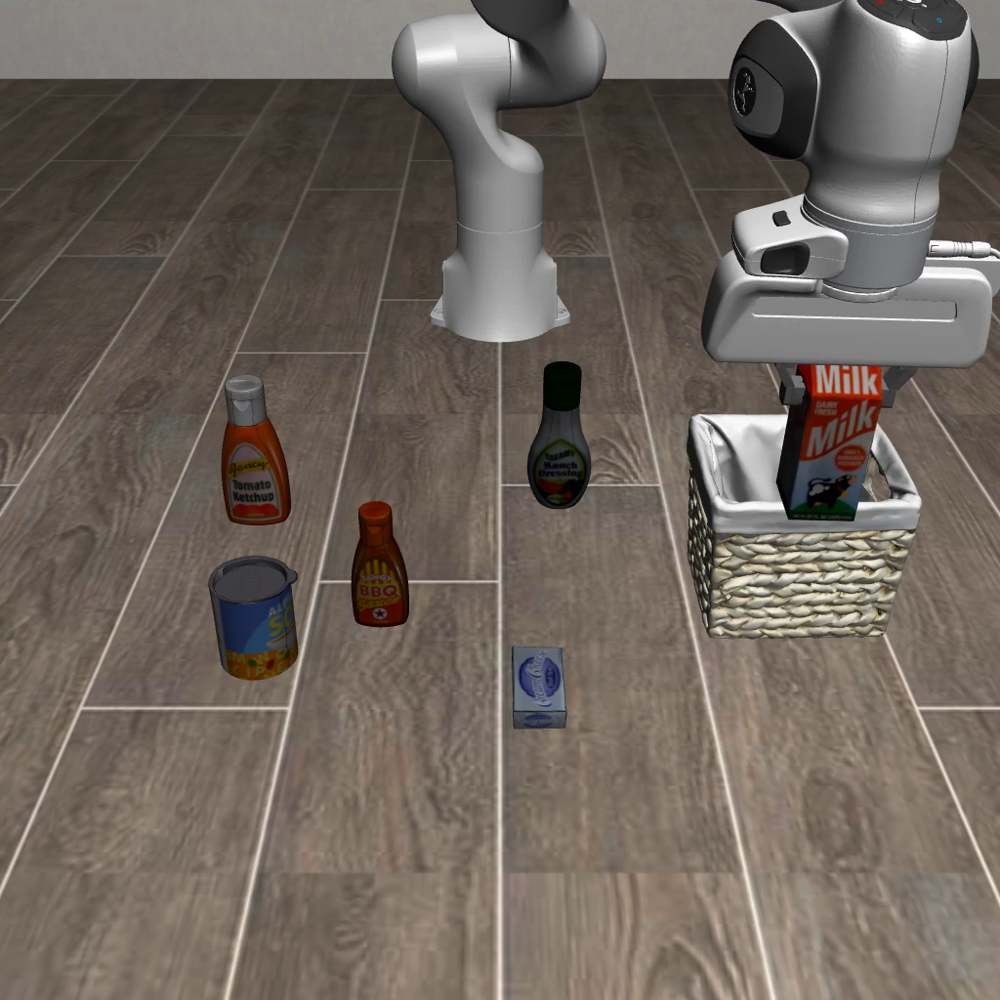
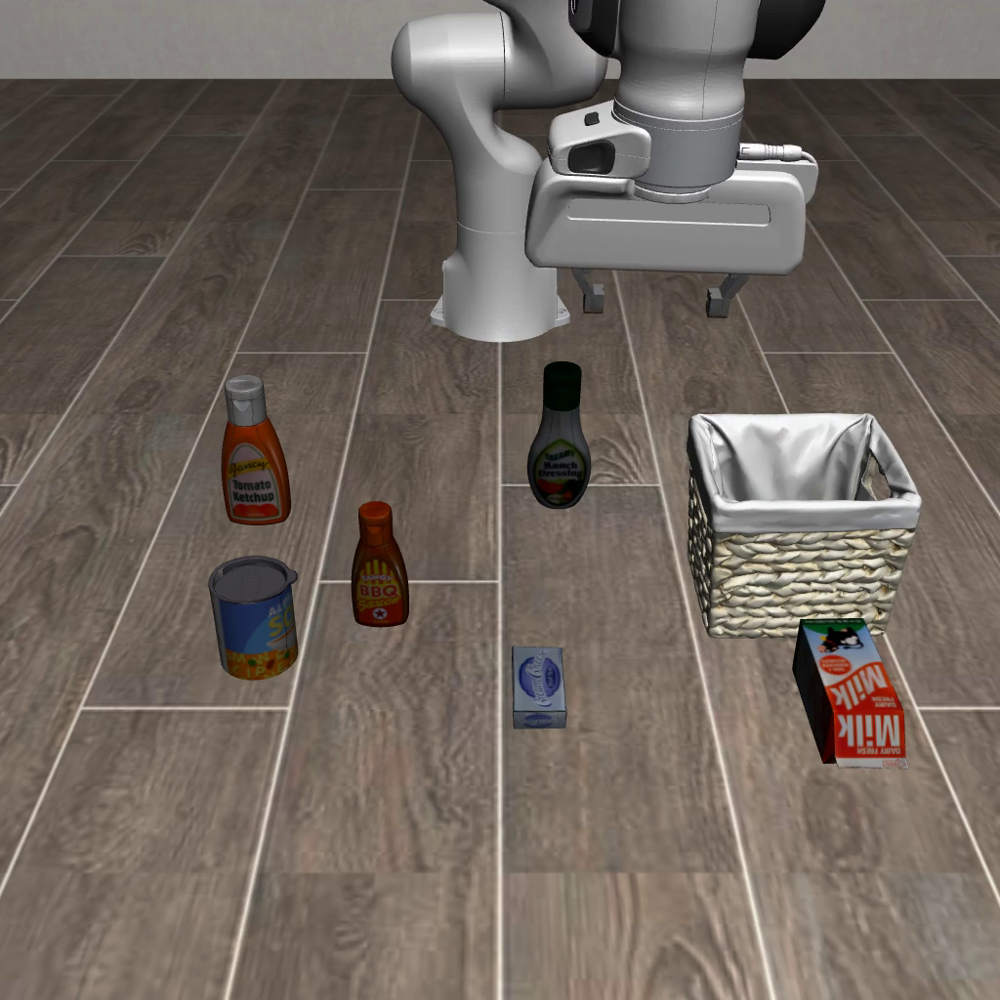
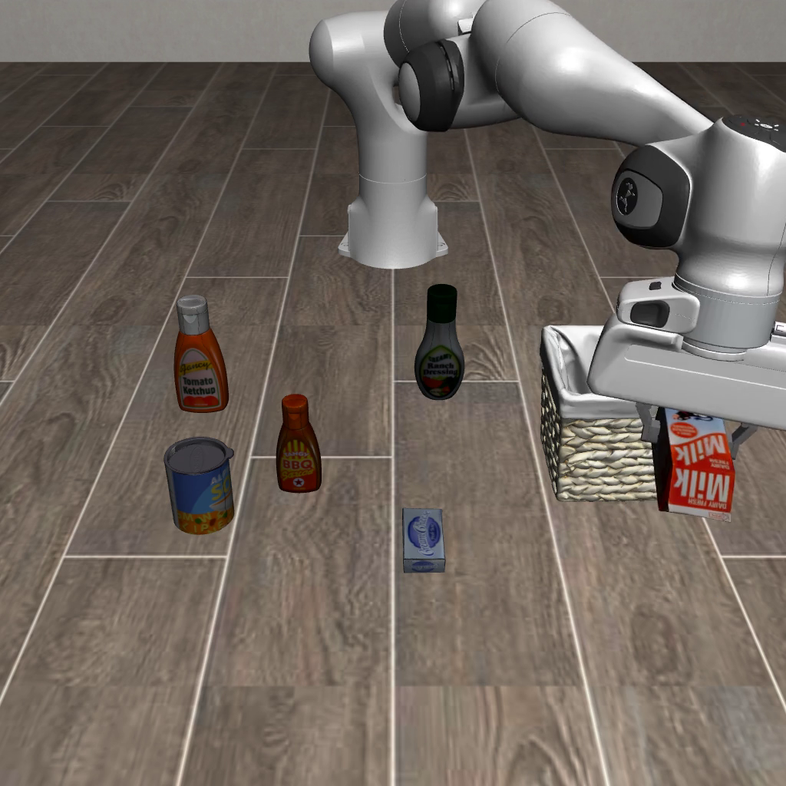
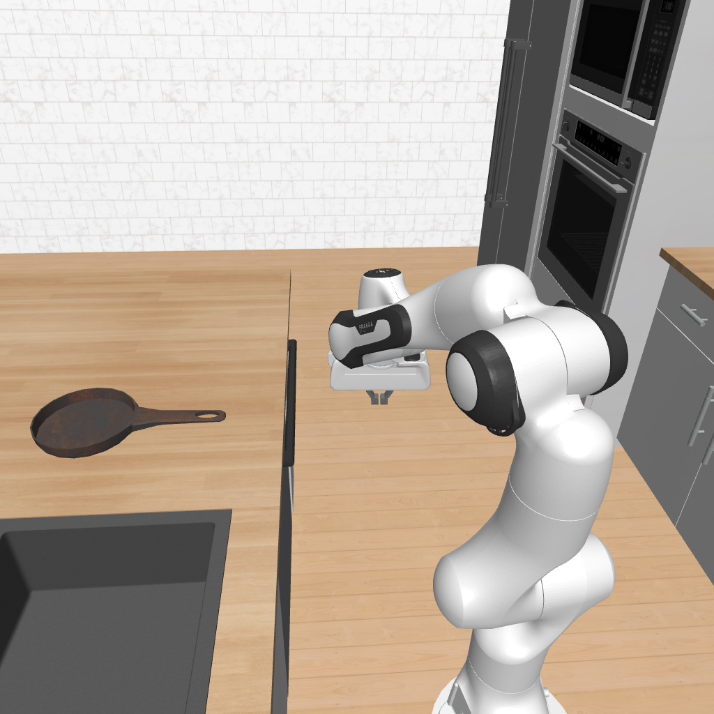

# 让 Frozen VLA 不再“一把梭”：清华于超老师团队提出 Harness VLA，把机器人基础模型变成可重试、可组合的操作原语

最近几年，机器人领域的一个核心趋势是 Vision-Language-Action Model，也就是常说的 VLA：模型直接看图像、读语言指令，然后输出机器人动作。

这条路线很有吸引力。只要数据规模足够大，VLA 就有机会学到很多过去很难手工建模的操作能力，比如抓取不规则物体、把物体放进狭窄容器、打开抽屉、按按钮、拧水龙头、操作微波炉等。这些“接触丰富”的动作，恰恰是传统解析控制最容易出问题的地方。

但 VLA 也有一个很现实的问题：它很强，却不一定稳。

当任务还是训练分布里熟悉的样子时，VLA 往往表现不错；一旦目标被重新指定、物体位置发生交换、空间布局变化，或者一个局部抓取没有完全成功，端到端策略就很容易沿着“记忆里的轨迹”继续执行，而不是重新理解当前任务。

清华于超老师团队的最新工作 **Harness VLA** 关注的正是这个问题：

> 已经训练好的 VLA 能不能不要重新训练，也不要无限扩充技能库，而是通过一个具备记忆、推理和重试能力的 Agent，把它“驾驭”成可靠的机器人操作模块？

这篇工作给出的答案是：可以。

Harness VLA 不把 frozen VLA 当成从头到尾控制整条轨迹的“大脑”，而是把它包装成一个 **可重试的接触丰富操作原语**。高层 Agent 负责语言理解、目标重定位、空间绑定、轨迹分解、失败诊断和重新 staging；VLA 只在真正需要视觉运动能力的局部接触阶段被调用。

一句话概括：

> Harness VLA 不是让 VLA 更大，而是让 VLA 被用得更对。

图 1：Harness VLA 的系统结构。Planner 读取任务描述、RGB-D 观测、机器人状态、Task Specific Memory 和 Global Memory，然后通过固定 primitive library 调用解析原语与 VLA 原语。

## 01. 为什么单纯依赖 VLA 还不够？

VLA 的优势很明确：它擅长从视觉中判断局部接触状态，并完成一些很难用规则写出来的动作。

例如，把一个形状不规则的物体抓起来；把锅、碗、海绵放进水槽；把物体塞进抽屉；在遮挡、摩擦、姿态变化下调整末端执行器。这些动作往往不是一个干净的几何规划问题，而是“看着当前状态不断修正”的物理交互问题。

但问题也出在这里。

端到端 VLA 通常是在某个任务分布上学习完整轨迹。模型学到的不只是“怎么抓”，也隐含学到了“通常抓哪个”“通常放哪里”“从哪个位置开始”“什么时候结束”。当部署时任务发生变化，它未必能把语言指令、目标物体、空间位置和当前状态重新绑定起来。

论文里把这类变化称为 deployment perturbations，包括：

- **semantic retargeting**：语言里的目标被重新指定，例如原来放 A，现在要求放 B；
- **goal re-binding**：目标条件变化，例如同样是移动物体，但终点区域不一样；
- **spatial-layout shift**：物体或容器位置发生交换，不能照着训练时的空间先验执行；
- **unstable local contact**：局部抓取、放置、按压没有完全成功，需要重新尝试。

这时，一个端到端 VLA 很可能出现两类失败：要么语言上“听错”，继续做熟悉任务；要么物理上“卡住”，一次局部接触失败后整条任务都失败。

图 2：论文的 teaser 图。灰色区域表示部署扰动，绿色区域表示 VLA 原本较熟悉的轨迹分布。Harness VLA 用解析原语完成目标感知、重定位、运输和重新 staging，只在接近 VLA 适合处理的局部接触状态时调用 VLA。

这张图其实点出了论文最核心的判断：  

**VLA 不应该负责所有事情。**

它应该负责自己最擅长的部分，也就是局部、短时、接触丰富的视觉运动控制；而语言解析、目标重定位、长程组合、空间运输、失败恢复这些事情，应该交给更适合做符号推理和闭环决策的 Agent。

## 02. Harness VLA：把 VLA 从“整条轨迹策略”变成“接触专家”

Harness VLA 的方法并不复杂，但切得很准。

系统里只有一个固定的 primitive library。高层 planner 每一步只能通过 JSON 调用这个库里的原语，不能在部署阶段临时发明新技能。

这些原语分成两类：

第一类是 **analytic primitives**，也就是解析控制原语。它们负责确定性比较强的动作，例如：

- `move_to`：把末端移动到某个空间位置；
- `move_pose`：同时调整位置和姿态；
- `rotate_wrist` / `rotate_pitch`：调整腕部方向；
- `set_gripper` / `release`：控制夹爪开合；
- `navigate_to` / `move_base`：在 RoboCasa 这类厨房任务中移动底盘。

第二类是 **VLA primitive**，也就是 `vla_act`。它不是整条任务的控制器，而是一个局部 contact-rich primitive。Planner 会给它一个当前子任务 prompt，并设置执行预算和停止条件，让 frozen VLA 在短时间内完成抓取、放置、按压、开合、插入等接触丰富动作。

这样一来，系统的分工就变成了：

- Agent 负责“想清楚现在该做什么”；
- analytic primitives 负责“把机器人送到合适位置”；
- VLA primitive 负责“在接触阶段把事情做成”；
- 执行后重新观察，如果失败，就重新定位、重新 staging、重新调用。

这和传统 hierarchical policy 的区别在于：Harness VLA 并不是训练一个新的高层策略，也不是把 VLA 融进一个新的端到端模型里。它更像给 frozen VLA 套上一个可解释、可观测、可记忆、可恢复的操作外壳。

VLA 仍然是 frozen 的。  
primitive library 也是固定的。  
真正变化的是 planner 学会了怎么使用这些固定工具。

## 03. 记忆机制：不是记住坐标，而是记住“怎么解题”

Harness VLA 里有两个很重要的记忆模块：**Task Specific Memory** 和 **Global Memory**。

Task Specific Memory 存的是某个任务成功执行过的 primitive trace。注意，它不是简单记录一串绝对坐标，也不是把完整轨迹 open-loop replay 一遍。成功 trace 会被参数化，里面的具体空间位置会被替换成可重新 grounding 的感知查询。

这意味着，当下一次物体位置变化、布局变化或者目标区域变化时，Agent 不是照抄上次坐标，而是借用上次的解题结构，再根据当前 RGB-D 观测重新绑定目标。

Global Memory 则更像系统级经验库。它记录一些跨任务复用的成功规则和失败模型，比如：

- 哪些 prompt 更容易让 VLA 完成当前 contact-rich 子任务；
- 哪些局部状态容易导致 empty grasp；
- 哪些视觉状态看起来像成功，但其实是 false success；
- 失败后应该怎么重新 staging，而不是原地重复同一个错误。

所以 Harness VLA 的记忆并不是“背答案”，而是在学会：

> 对一类任务，什么结构可靠？什么局部状态适合调用 VLA？什么失败需要换姿态再试？

这一点对机器人很关键。因为真实操作环境里，重复执行几乎从来不是重复同一条轨迹，而是重复同一个“解题逻辑”。

## 04. 执行流程：每一步都看结果，而不是一路滚到底

Harness VLA 的 rollout 是一个 turn-based execution loop。

每一步，planner 都会读取当前观测，包括 RGB 图像、深度图、机器人状态、任务语言和记忆上下文。然后它输出一个结构化 JSON primitive 调用。物理引擎执行这个 primitive，直到内部停止条件满足，再返回新的观测。Planner 根据新观测决定下一步。

这个循环有一个非常重要的效果：**失败被局部化了。**

在端到端 VLA 里，一次抓取没抓稳，后面动作可能继续执行，最后才发现失败；在 Harness VLA 里，VLA 调用是短时的，执行后 planner 会重新观察。如果杯子没拿起来、物体没进篮子、锅还没放进水槽，就可以重新移动、换姿态、换视角，再次调用 `vla_act`。

这也是论文标题里 “Harness” 的含义：不是替代 VLA，而是驯服它、约束它、让它在合适的上下文中发挥作用。

## 05. 实验结果：不是只在简单任务上好看

论文在四类 benchmark 上评估 Harness VLA：

- **LIBERO**：标准桌面操作任务；
- **LIBERO-Pro**：带 instruction-redirection 和 position-swap 的扰动任务；
- **RoboCasa365**：更长程的厨房家庭操作任务；
- **RoboTwin C2R**：双臂机器人 clean-to-randomized transfer。

整体结果很直接：

| Benchmark | Frozen VLA baseline | Harness VLA |
| --- | ---: | ---: |
| LIBERO-Pro | RLinf 50% | Harness VLA (CC) 82% |
| RoboCasa365 | RLDX-1 weighted overall 30% | Harness VLA (Codex) 55% |
| RoboTwin C2R | 代表性 VLA baseline 最高 47.9% | Harness VLA 58% |
| Standard LIBERO | RLinf 95.3% | Harness VLA (CC) 96.0% |

这里最值得注意的不是标准 LIBERO 上多了多少，而是 LIBERO-Pro 和 RoboCasa365 上的提升。

Standard LIBERO 说明 Harness VLA 没有破坏 frozen VLA 原本的强项；LIBERO-Pro 和 RoboCasa365 则说明，一旦进入语义重定向、位置交换、厨房长程组合这些更真实的部署扰动，agentic harness 的价值就会非常明显。

图 3：LIBERO-Pro 中的扰动桌面操作场景。位置交换、目标重定向等设置会放大端到端 VLA 对训练轨迹分布的依赖。

在 LIBERO-Pro 上，direct frozen VLA baseline RLinf 的整体成功率是 50%。Harness VLA 使用同一个 frozen VLA 作为 `vla_act`，但通过 planner 负责 semantic grounding、spatial re-binding 和失败后的 re-staging，最高达到 82%。

换句话说，提升不是来自一个更强的底层 VLA，而是来自更合理的使用方式。

图 4：RoboCasa365 任务包含移动 staging、器具交互和更长程的厨房操作组合，对单一端到端 rollout 更具挑战。

在 RoboCasa365 上，RLDX-1 的 weighted overall 成功率为 30%，Harness VLA (Codex) 达到 55%。这类厨房任务通常不仅要抓取物体，还要移动到底盘可达位置、搜索目标区域、打开或关闭装置、把物体放进容器，再根据结果继续下一步。Planner 对导航、staging 和 re-staging 的作用会被进一步放大。

图 5：RoboTwin C2R 评估 clean-to-randomized transfer，覆盖双臂抓取、放置、交接、容器操作等任务。

在 RoboTwin C2R 上，Harness VLA 达到 58%。这个设置要求系统从 clean setting 的 task-specific trace 直接迁移到 randomized setting，不做额外的 randomized-setting bootstrapping，也不对 VLA 微调。

## 06. 为什么重试有用？VLA 调用次数给出了答案

论文里有一个很有意思的分析：限制每个 episode 里最多可以调用多少次 VLA primitive，然后看任务成功率怎么变化。

结果显示，在 LIBERO-Pro 上，不允许 VLA 调用时成功率只有 3%；允许 1 次调用后到 52%，2 次到 68%，继续增加后逐渐接近完整 Harness VLA 的 82%。

图 6：LIBERO-Pro 上，随着每个 episode 允许更多次 planner-selected VLA invocation，累计任务成功率快速上升，并最终接近完整 Harness VLA 表现。

这张图说明了两件事。

第一，VLA 仍然非常重要。没有 VLA 的接触丰富能力，只靠解析原语很难完成很多任务。

第二，VLA 不应该只被调用一次。一次局部接触失败不该让整个 episode 结束。更合理的方式是：planner 观察失败原因，重新调整空间位置或末端姿态，再让 VLA 尝试一次。

这和人做家务其实很像。你第一次没把杯子拿稳，不会从头重启整个任务；你会调整一下手的位置，再抓一次。

Harness VLA 把这种“看结果、调姿态、再尝试”的过程显式写进了 agentic loop。

## 07. 解析原语和 VLA 原语到底怎么分工？

为了验证分工是否合理，论文统计了成功 rollout 最后是由哪类 primitive 触发完成条件。

图 7：任务完成归因。LIBERO 系列里，很多任务在 VLA 建立稳定接触后，由解析原语完成最后运输、释放或重定位；RoboCasa365 和 RoboTwin 中，更多任务结束在接触丰富的 VLA primitive 内。

这个结果很符合直觉。

在 LIBERO-family 桌面任务里，VLA 往往负责建立接触，比如抓起目标物体；一旦抓稳，后续把物体移动到目标位置、打开夹爪、释放，解析原语就很适合完成。所以很多任务的最终 success predicate 是由 analytic primitive 触发的。

而在 RoboCasa365 和 RoboTwin 里，任务末端经常就是一个 contact-rich 操作，比如按开关、关门、把物体塞进容器、双臂协作完成最终状态。这时最后一步更可能落在 VLA primitive 里。

这说明 Harness VLA 并不是简单地“用解析控制替代 VLA”，也不是“用 VLA 替代所有控制”。它的核心是明确边界：

> 非接触、可几何化、可确定执行的部分交给 analytic primitives；接触丰富、视觉运动耦合强、难以手写规则的部分交给 VLA。

## 08. 一个典型案例：失败不是终点，而是下一步信息

论文中展示了多个 rollout case。以 LIBERO-Pro 的物体放置任务为例，planner 先调用 `vla_act` 尝试抓取目标物体。如果中间发现物体没有稳定进入篮子，或者抓取结果不完整，planner 不会继续盲目执行，而是重新移动末端、重新定位目标，再调用 VLA。

图 8：LIBERO-Pro rollout 中的若干关键帧。Planner 将 VLA 调用视为可诊断、可重新 staging 的局部接触尝试，而不是一次性完整策略。

再看 RoboCasa365 的 PreSoakPan 任务。系统需要围绕锅、水槽、水龙头进行多阶段操作。Planner 会调整移动底盘和机械臂姿态，让 VLA 在合适局部状态下完成抓锅、放入水槽、打开水龙头等 contact-rich 子任务。

图 9：RoboCasa365 中，移动底盘和机械臂 staging 由解析原语完成，接触丰富的局部操作由 VLA primitive 完成。

这种结构把失败转化成了信息。每次 primitive 执行后，planner 都能看到新的世界状态，并基于这个状态重新做决定。这正是机器人从“离线轨迹模仿”走向“在线闭环执行”时需要补上的能力。

## 09. 这篇工作的启发：机器人基础模型可能需要一个更好的使用接口

Harness VLA 的价值不只是一个 benchmark 提升。

它提出了一个很有启发性的系统观点：  

**未来的机器人基础模型未必总是直接端到端控制整条任务。更可能的形态，是作为一组强但有边界的能力模块，被高层 agent 以闭环方式调用。**

对 VLA 来说，这尤其重要。

VLA 的训练数据决定了它对某些局部视觉运动模式很敏感，也很擅长。但如果把语言理解、任务规划、空间泛化、错误恢复都塞进同一个 end-to-end action head，模型就必须同时解决太多层次的问题。

Harness VLA 的做法更工程化，也更接近真实机器人系统：

- 不要求每次环境变化都重新训练 VLA；
- 不要求 agent 在部署阶段临时发明新 primitive；
- 不把一次局部接触失败当成全局失败；
- 不把记忆当成 open-loop 轨迹，而是当成可重新 grounding 的解题结构；
- 不否认解析控制的价值，而是让它承担最适合它的非接触执行部分。

这种“VLA + Agent + Memory + Fixed Primitive Library”的结构，可能会成为将机器人基础模型落到可靠长程任务上的重要范式。

## 10. 当然，它还不是终点

论文也明确提到了当前方法的限制。

首先，高层 planner 和低层 VLA 之间仍然是一个相对开放的反馈回路。Planner 可以观察 primitive 执行后的结果，但并没有和 VLA 在更细粒度上共同优化。

其次，系统还没有通过环境奖励或人类偏好对整体执行过程进行联合微调。未来如果能把 agentic loop 和更高效的强化学习结合起来，可能进一步提升稳定性。

第三，在高度杂乱、长程任务中，缺少更细粒度的图像 captioning 或结构化视觉理解，也会限制 planner 对复杂场景的推理能力。

但从系统设计角度看，Harness VLA 已经给出了一个很清晰的方向：  

> 与其期待一个 frozen VLA 在所有场景里端到端解决所有问题，不如让它成为一个强大的局部接触专家，再用记忆和 agentic planning 把它接入完整的闭环操作系统。

## 结语

过去我们常问：VLA 能不能学会机器人操作？

Harness VLA 换了一个问题：  

> 当 VLA 已经会做很多局部操作时，我们怎样才能更可靠地使用它？

这可能是机器人基础模型走向真实部署时更关键的问题。

因为真正的机器人任务不是一次性生成一段完美动作，而是在不断变化的世界里观察、判断、尝试、失败、恢复、再尝试。Harness VLA 的贡献就在于，它把 frozen VLA 放进了这样一个可记忆、可组合、可重试的闭环框架中。

对机器人/具身智能研究者来说，这篇工作值得关注的不只是实验数字，还有背后的方法论：  

**让基础模型负责它最擅长的部分，让系统架构补上它不擅长的部分。**

---

**论文标题**：Harness VLA: Steering Frozen VLAs into Reliable Manipulation Primitives via Memory-Guided Agents

**团队**：清华于超老师团队

**项目主页**：`<PROJECT_PAGE_URL>`

**论文链接**：`<PAPER_URL>`

**代码链接**：`<CODE_URL>`

**模型/数据链接**：`<MODEL_OR_DATA_URL>`

**一句话推荐**：如果你关注 VLA、LLM Agent、机器人长程操作、memory-based planning 或具身智能系统架构，这篇工作很值得读。
